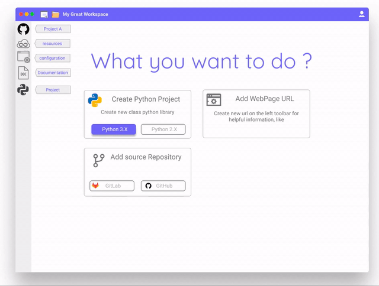
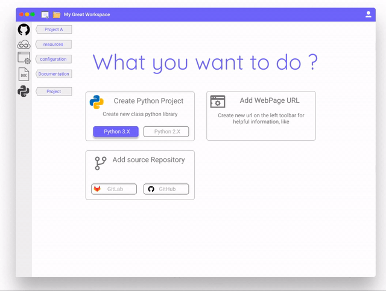
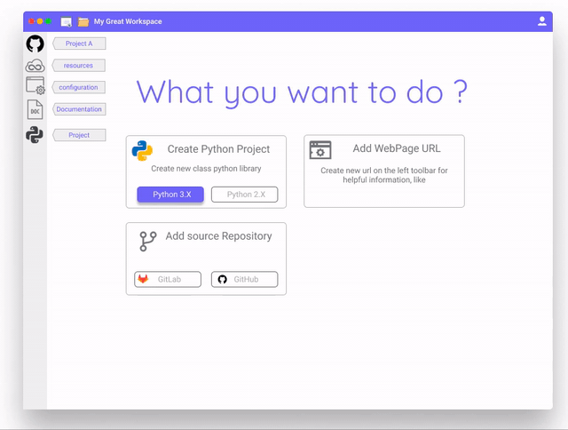
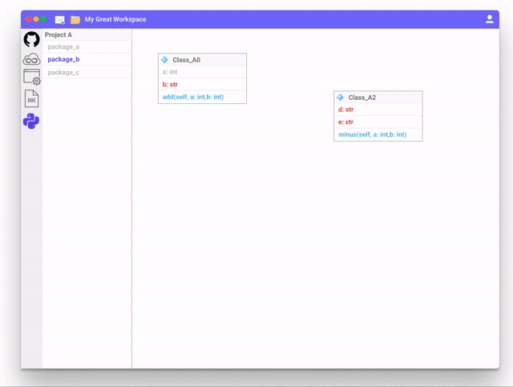

# AMADA Workspace

Project in the concept stage of how to manage the whole bunch of additional stuff in the project, without knowing the tools.

## Project Views

### Main View

### Resources

### Configuration

### Documentation

### Code editing 

