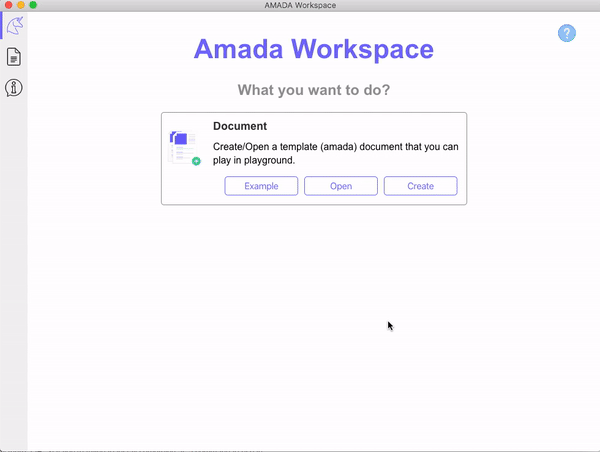

# AMADA Workspace

[](https://app.fossa.io/projects/git%2Bgithub.com%2Falexiej%2Famada-workspace?ref=badge_shield)

Project in the concept stage of how to manage the whole bunch of additional stuff in the project, without knowing the tools.

# Download 



### ⚠ <span style="color:red">This is the pre-release version of the software</span>

[](https://github.com/alexiej/amada-workspace/releases/download/alpha-01/amada-workspace-0.1.0.dmg)

### Features (AMADA Workspace v0.2 alpha):

* Edit files like blocks, and save files to .amada JSON format
* Available blocks
  * Headers
  * Tables
  * Images from Clipboard
  * Code
  * Paragraphs
  * Lists
  * Todo lists
* Outline view
* Files view
* Drag&Drop files

### Next version planned features:

* Export to .md (markdown format), and .pdf format
* Import .md format (markdown format)
* Better code writing
  * Header - format code like in markdown (#, ## etc.. creates a markdown)
  * Code - add language for the code (shortuct ````code` creates new code)
  * Tables - beter tables editor
  * Images - available for add images from drive
* Add more shorcuts for better expierience
* Assosiate .amada files
* Reformat .amada files to other than JSON format for better read source.
* Add source view of .amada file
* Fix outline view, files view
* Show last files in the main window
* Add possibility to remove files from the list
* Add search possibility

# Project Planned Features

### Main View


### Resources


### Configuration


### Documentation


### Code editing 


# Licence

[](https://app.fossa.io/projects/git%2Bgithub.com%2Falexiej%2Famada-workspace?ref=badge_large)


